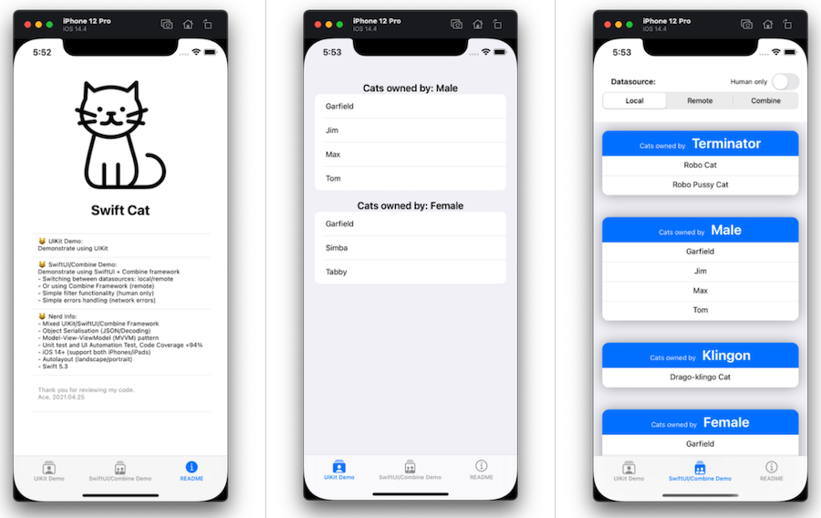
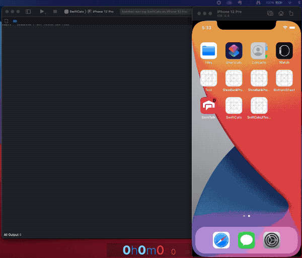
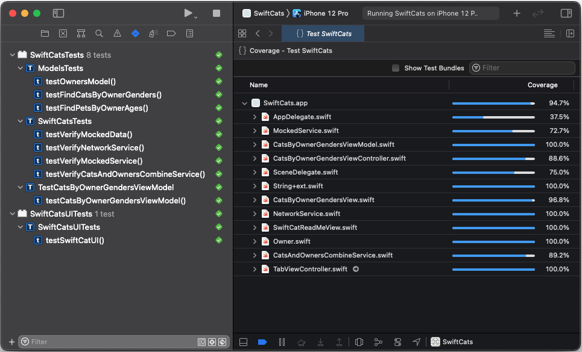

# Swift Cat - Programming Challenge - ANZAC 2021

Welcome to Swift Cat Programing Challenge. This is part of Programming Challenge I participated during tha ANZAC holiday 2021. This programming challenge demonstrates mobile application developoment using technologies mentioned below.

## First - What you will need

- A Mac with Mac OS 11.2.3 with at least 16 GB of RAM

- Xcode 12.4

- iOS Simulators with at least iOS 14.4

- Git source code management 

### Setup Instructions

- Git clone from this git repo

- Change directory to `agl-swift-cats`

- Use `Xcode` to open the project file: `SwiftCats.xcodeproj`

- Select `SwiftCats` target

- Select a simulator of your choice, i.e. `iPhone 12 Pro`

- Select `Build` (or CMD-b) from Xcode's Product menu

- Select `Run` (or CMD-r) to deploy the app and run on the selected simulator

- Select `Test` (or CMD-u) to execute all unit tests and test automation

## Features and Technologies

| Features | Technologies |
|----------|--------------|
| - Utilises REST API and Data Serialisation (JSON) | - iOS 14.4 |
| - Retrieve data from remote or mocked services | - Swift 5.4 |
| - Simple list and filter data from selected datasource | - Project mixed UIKit + SwiftUI |
| - Auto Layout w/ Multiple iOS Devices | - Combine Framework |
| - Support both Portrait/Landscape modes | - Unit Test with XCTest |
| - Support Accessibility Scalable Text Sizes | - UI Automation Test with XCUITest |
| - Simple Error Handling | - Model-View-ViewModel (MVVM) Design Pattern |
| - No third-party libraries were used | - Test Coverage |

## Design Pattern

This application was designed and developed using MVVM Design Pattern.

## Code Organisation

- Service Layer
  - NetworkService.swift
    - This is the original network service that was provided as a starting point of this project
  - MockedService.swift
    - Provide static data for development and test, i.e. contains data where there are more than 2 genders for cat owners.
  - CatsAndOwnersCombineService.swift
    - Network service implemented using Apple's Combine Framework

- Model
  - Owner.swift
    - Contained data modeling for cat owners
    - Contained several fixes and enhancement functionality
  - Pet.swift
    - Data modeling for pets 

- View Model
  - CatsByOwnerGendersViewModel.swift
    - Provide data representationi for displaying cats by owner genders
    - Support 3 datasources:
      - Network Service (this is the original service provided as a starting point)
      - Mocked Service (for development and testing)
      - Combine Service (Apple Combine Framework)

- View Layer
  - UIKit (views and controllers)
    - TabViewController.swift
    - CatsByOwnerGendersViewController.swift
  - SwiftUI
    - CatsByOwnerGendersView.swift
    - SwiftCatReadMeView.swift

## Unit Test & UI Automation Tests & Code Coverage

## References

- [README - Original](README-original.md)

- [Easter Challenge](https://github.com/primecoder/easter-2021-challenge)

## Thank You

Thank you for visiting my page.

Ace Authors
2021.04.25